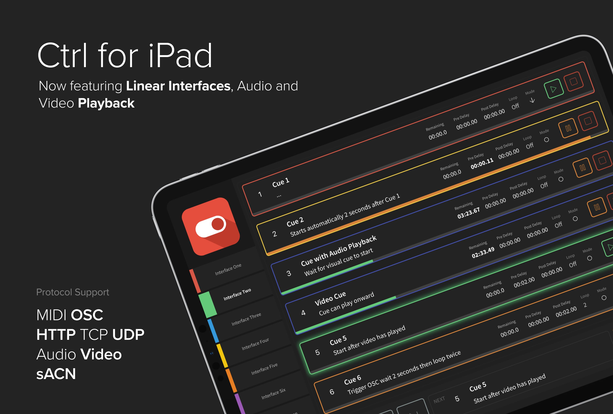

 

## Get Started
- Visit the [Ctrl for iPad](https://labs.onlx.ltd/ctrl-for-ipad) website
- Download exclusive from the [App Store](https://apps.apple.com/gb/app/ctrl-for-ipad/id1247514528)

## Useful Links
- Get support within our community via [Discussions](https://github.com/onlxltd/ctrl-for-ipad/discussions)
- Read our documentation in the [User Manual](https://docs.onlx.ltd/ctrl-for-ipad)
- Look through previously asked questions in the [Knowledge Base](https://docs.onlx.ltd/knowledge-base)

## What does Ctrl for iPad do?

Ctrl for iPad makes it simple to create intuitive user interfaces that allow control over multiple systems including audio, video and lighting on a familiar device.

Create multiple pages of playlists, sliders, buttons, video controls, images and much more to give as much or as little as you like to make controlling a complex installation or setup a breeze.

Before the conception of Ctrl for iPad, we were looking for a touch screen interface for use on our own installations. We found the best option instead of developing custom hardware was to create an application based around the iPads compact design. Along with its multiple form factors, continual security updates and wide availability, an iPad paired with a professional mounting solution commercial grade button was a no-brainer when compared to button plates plates at a lower cost.

All editing can be carried out within the App itself meaning all you need is your iPad. When you’re done designing, change out of edit mode to allow your interface to run.
